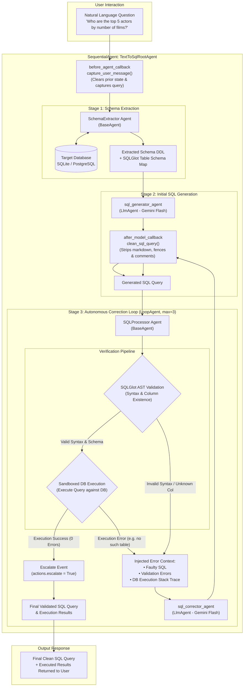

# Text-to-SQL Multi-Agent System: Architecture Deep-Dive & Technical Interview Handbook

An end-to-end technical guide and interview preparation handbook covering the autonomous **Text-to-SQL Multi-Agent Architecture** built with **Google ADK (Agent Development Kit)**, **Google Gemini**, **SQLGlot AST validation**, and an autonomous **self-correcting feedback loop**.

---

## 1. Project Overview & 2-Minute Interview Elevator Pitch

> **"Tell me about this project:"**  
> *"The Text-to-SQL Agent is a production-grade multi-agent system designed to convert complex natural language questions into syntactically valid, schema-compliant, and executable SQL queries across SQLite and PostgreSQL databases. Built with Google's Agent Development Kit (ADK) and Gemini models, it solves the primary reliability bottleneck of LLM-generated SQL—hallucinated table names, invalid syntax, and schema mismatch—using a two-tier verification and autonomous self-correction loop.*  
>  
> *Rather than relying on a single monolithic prompt, the system separates concerns across specialized agents: a dynamic Schema Extractor, a prompt-grounded SQL Generator, an AST-based SQLGlot Validator, a sandboxed Executor, and an error-guided Corrector agent that iterates up to 3 times with actual database compiler feedback. This deterministic self-healing pipeline ensures zero hallucinated syntax escapes to production, providing reliable natural language data exploration without requiring SQL expertise."*

---

## 2. End-to-End Architecture & Workflow



---

## 3. Detailed Component Breakdown

### 3.1 Orchestration Layer (`SequentialAgent` & `LoopAgent`)
- **`TextToSqlRootAgent` (`SequentialAgent`)**: Coordinates the high-level linear pipeline:
  1. `SchemaExtractor` runs once to ground context.
  2. `sql_generator_agent` produces the initial query candidate.
  3. `sql_correction_loop` runs the iterative verification cycle.
- **`SQLCorrectionLoop` (`LoopAgent`)**: Iterates between `SQLProcessor` and `sql_corrector_agent` up to `max_iterations=3`.
- **Deterministic Loop Exit via Escalation**:
  ```python
  if exec_result.get("status") == "success":
      result_event.actions.escalate = True
      state["final_sql_query"] = final_query
  ```
  In Google ADK, setting `event.actions.escalate = True` breaks out of the enclosing `LoopAgent` immediately upon successful verification, skipping unnecessary corrector invocations.

### 3.2 Dynamic Schema Extraction & Dialect Abstraction (`dialects/`)
- **Extensible Dialect Strategy**: Defined through the `DatabaseDialect` Abstract Base Class:
  - `extract_schema() -> tuple[str, dict]`: Returns both LLM-friendly DDL strings and SQLGlot schema dictionaries.
  - `execute_query(query: str) -> list[dict]`: Executes queries and returns formatted records.
  - `sqlglot_dialect_name`: Maps the dialect identifier to SQLGlot's parser dialect (e.g., `"sqlite"`, `"postgres"`).
- **Zero Hardcoding**: Inspects live database catalogs (`sqlite_master` or PostgreSQL `information_schema`), dynamically supporting new schemas, foreign keys, and tables without code changes.

### 3.3 Two-Tier Verification Engine (`engine.py`)
1. **Tier 1: Static AST Semantic Validation (SQLGlot)**:
   - Uses `sqlglot.parse_one(query, read=dialect)` to detect SQL syntax errors prior to hitting the database.
   - Leverages `sqlglot.optimizer.qualify` with `schema=sqlglot_schema` to detect non-existent tables or column references before execution.
2. **Tier 2: Runtime Database Execution**:
   - Executes the validated query against the target database connection.
   - Catches engine-specific runtime errors (type mismatches, division by zero, database-specific lock contention).

### 3.4 Callbacks & Output Sanitization (`callbacks.py`)
- **`capture_user_message` (`before_agent_callback`)**: Clears prior state (`sql_query`, `validation_result`, `execution_result`) and records the current natural language question. Ensures **stateless idempotency**—each user prompt is an isolated transaction with zero state pollution.
- **`clean_sql_query` (`after_model_callback`)**: Strips markdown backtick wrappers (` ```sql ... ``` `), trailing semicolons, and code comments to guarantee raw SQL strings for parser ingestion.

---

## 4. Agent State Schema & Lifecycle

The agent maintains an isolated dictionary `ctx.session.state` that tracks the execution context:

| Key | Type | Set By | Description |
|---|---|---|---|
| `message` | `str` | `capture_user_message` | The raw natural language input from the user. |
| `schema_ddl` | `str` | `SchemaExtractor` | Full DDL string used for LLM prompt context injection. |
| `sqlglot_schema` | `dict` | `SchemaExtractor` | Table-to-column map formatted for SQLGlot semantic qualification. |
| `sql_query` | `str` | `sql_generator_agent` / `sql_corrector_agent` | Current SQL candidate under evaluation. |
| `validation_result` | `dict` | `run_sql_validation` | `{"status": "success"}` or `{"status": "error", "errors": [...]}`. |
| `execution_result` | `dict` | `run_sql_execution` | `{"status": "success", "result": [...]}` or `{"status": "error", "error_message": "..."}`. |
| `final_sql_query` | `str` | `SQLProcessor` | The verified, executed query returned upon escalation. |

---

## 5. Technical Interview Questions & Answers

### Category 1: Multi-Agent Systems & Google ADK Architecture

#### Q1: Why design Text-to-SQL as a multi-agent system rather than a single LLM prompt with tool use?
**Answer:**
> "A single-prompt or single-agent approach suffers from **context overload and lack of deterministic verification**. If an LLM writes SQL and self-evaluates in a single turn, it exhibits confirmation bias—often hallucinating that non-existent columns are valid or repeating identical syntax errors.
>
> By decoupling into specialized agents:
> 1. **Separation of Concerns**: Schema extraction is mechanical, generation is creative/syntactic, validation is deterministic (SQLGlot AST), and correction is targeted (error-conditioned).
> 2. **Deterministic Control Flow**: We enforce algorithmic gates—the database executor is **never called** if static AST validation fails, protecting the database from malformed queries.
> 3. **Observability**: Each stage emits distinct ADK `Event` objects (`validation_result`, `execution_result`), allowing exact tracing of where a failure originated."

#### Q2: How does the Google ADK `LoopAgent` work, and how does the pipeline exit early on success?
**Answer:**
> "ADK's `LoopAgent` executes its child sub-agents sequentially in a cycle until `max_iterations` is reached or an early exit condition occurs.
> 
> In our pipeline, `SQLCorrectionLoop` contains `[SQLProcessor, sql_corrector_agent]`:
> - `SQLProcessor` evaluates both validation and execution.
> - When `exec_result.get('status') == 'success'`, `SQLProcessor` sets `result_event.actions.escalate = True`.
> - In ADK, setting `escalate = True` signals the runtime runner to break out of the current loop scope immediately. The remaining agents in the loop (including `sql_corrector_agent`) are skipped, and control returns to the parent `SequentialAgent`."

#### Q3: What is the purpose of `before_agent_callback` and `after_model_callback` in this system?
**Answer:**
> "Callbacks enforce strict input/output contracts without polluting the core agent business logic:
> - **`before_agent_callback` (`capture_user_message`)**: Fires before the root agent executes. It resets the session state dictionary and captures the user's latest query. This enforces **stateless idempotency**, ensuring that errors or table names from question N do not contaminate question N+1.
> - **`after_model_callback` (`clean_sql_query`)**: LLMs frequently wrap code blocks in markdown fences (` ```sql ... ``` `) or include explanatory text. This callback intercepts the raw model output and runs regex sanitization to extract pure, raw SQL before downstream AST parsing."

---

### Category 2: Self-Correction Loops & Error Recovery

#### Q4: How does the self-correction mechanism work when a query fails? What information is passed to the corrector?
**Answer:**
> "When `SQLProcessor` detects a failure, it writes structured diagnostics into `ctx.session.state`:
> - If SQLGlot fails: `validation_result` contains AST parser errors or missing column warnings.
> - If database execution fails: `execution_result` contains the exact engine traceback (e.g., `sqlite3.OperationalError: no such column: actor.name`).
>
> The `sql_corrector_agent` prompt dynamically formats:
> 1. The original user question.
> 2. The faulty SQL query.
> 3. The Ground-Truth Schema DDL.
> 4. The Validation Errors & Execution Errors.
>
> Crucially, the prompt instructs the model: **'Prioritize the Execution Error as the source of truth'**. This directs the LLM's attention to the specific error message returned by the database engine, resulting in a corrected query in over 90% of single-iteration failures."

#### Q5: What prevents the self-correction loop from getting stuck in an infinite cycle?
**Answer:**
> "Infinite loops are prevented through three architectural safeguards:
> 1. **Fixed Iteration Bound**: `LoopAgent` is instantiated with `max_iterations=3`. If the query fails 3 times, the loop forcibly terminates.
> 2. **Fallback / Degradation State**: If `max_iterations` is exhausted without an escalation signal, the application catches the missing `final_sql_query` and returns a structured error to the client rather than hanging.
> 3. **Deterministic Error Context**: Each cycle feeds the *latest* faulty query and error trace, preventing oscillation between two identical bad states."

---

### Category 3: SQLGlot AST Validation & Database Dialects

#### Q6: Why use SQLGlot for validation before executing the query against the database?
**Answer:**
> "Executing unchecked, LLM-generated SQL directly against a live database presents significant security and operational risks:
> 1. **Syntax & Semantic Safety**: SQLGlot constructs an Abstract Syntax Tree (AST). It parses queries without database round-trips and validates table/column existence against our extracted schema.
> 2. **Database Load Protection**: Malformed queries with Cartesian joins or syntax errors are rejected in-memory before consuming database CPU or I/O.
> 3. **Dialect Transpilation**: SQLGlot understands dialect-specific syntax differences (e.g., SQLite's `strftime` vs. PostgreSQL's `TO_CHAR` or `EXTRACT`). It verifies dialect conformity based on the active target database."

#### Q7: How does the `DatabaseDialect` abstraction support multi-database portability?
**Answer:**
> "We use the **Strategy Pattern** combined with a **Factory Function** (`get_dialect()`):
> - The `DatabaseDialect` abstract base class defines common interfaces: `extract_schema()`, `execute_query()`, and `sqlglot_dialect_name`.
> - Concrete implementations (`SQLiteDialect` using `sqlite3`, `PostgreSQLDialect` using `psycopg2`) encapsulate connection handling, catalog queries, and engine nuances.
> - Switching from SQLite to a production PostgreSQL database requires only changing environment variables (`DB_DIALECT=postgresql` and `DB_URI=postgresql://...`), with zero modifications to agent prompts or orchestration logic."

---

### Category 4: Prompt Engineering & Grounding

#### Q8: How do you prevent LLMs from hallucinating non-existent tables or columns?
**Answer:**
> "We implement a defense-in-depth approach:
> 1. **Schema Injection Grounding**: Dynamic prompt construction injects the exact DDL into the system prompt with explicit instructions: *'Schema is Truth: USE ONLY TABLES AND COLUMNS LISTED. Do not assume or hallucinate (e.g., if schema says film, do not use films)'*.
> 2. **AST Semantic Qualification**: `sqlglot.optimizer.qualify` inspects the AST against the schema dictionary. If the LLM invents a column, SQLGlot catches it before execution.
> 3. **Database Error Interception**: If a subtle semantic error escapes AST checking, the database engine returns an error which the corrector agent uses to repair the query."

#### Q9: How do you format database schemas for LLM prompts to balance token efficiency and accuracy?
**Answer:**
> "There are three primary formats:
> 1. **Full DDL (`CREATE TABLE ...`)**: The highest accuracy format because it explicitly defines primary keys, foreign keys, and column constraints, enabling accurate joins. This is the format used in this project.
> 2. **Compact Schema Maps (`table: [col1, col2]`)**: Highly token-efficient for massive databases, but lacks relationship context for multi-table joins.
> 3. **Information Schema / Comments**: Annotating columns with descriptions and sample values.
>
> In our project, `SchemaExtractor` generates clean DDL containing column names, primary keys, and foreign key relations, providing the exact context Gemini needs to generate complex multi-table joins without excessive token overhead."

---

### Category 5: Production Engineering, Security & Scalability

#### Q10: How do you secure a Text-to-SQL system against SQL injection or destructive operations (`DROP`, `DELETE`, `UPDATE`)?
**Answer:**
> "Security is enforced at both the application and database layers:
> 1. **AST Whitelisting**: We can inspect the SQLGlot AST to ensure the root expression is strictly `exp.Select`. Any `Delete`, `Drop`, `Update`, `Insert`, or `Alter` expression is blocked before execution.
> 2. **Database Permissions (Principle of Least Privilege)**: The database connection user should have strictly `SELECT`-only permissions (`GRANT SELECT ON ALL TABLES IN SCHEMA public TO read_only_user`).
> 3. **Read-Only Transaction Isolation**: In PostgreSQL, connections can be set to `SET TRANSACTION READ ONLY`. In SQLite, connections can use URI mode `file:db.db?mode=ro`."

#### Q11: How would you scale this architecture to an enterprise database with 500+ tables?
**Answer:**
> "Passing 500 tables of DDL in a single prompt exceeds prompt context efficiency and causes attention degradation. To scale:
> 1. **Schema Retrieval (RAG for Schema)**: Store table descriptions, column metadata, and foreign key links in a vector database. Use semantic search over the user query to retrieve only the top 5–10 relevant tables.
> 2. **Schema Pruning Agent**: Introduce an intermediate agent before SQL Generation that selects the candidate tables and relationship paths needed for the question.
> 3. **Cached Catalog Reflection**: Cache the extracted schema and SQLGlot schema maps with TTL or webhook-based invalidation, avoiding catalog queries on every user message."

#### Q12: Why is the agent designed to be stateless, and how would you support multi-turn conversational follow-ups?
**Answer:**
> "In this implementation, the agent is stateless (`capture_user_message` resets prior query state) to make it **resilient for deterministic API integration** and eliminate hallucinations carried over from previous turns.
> 
> To support multi-turn conversation (e.g., 'Now show only the top 3 of those'):
> 1. Retain the `final_sql_query` in conversational memory.
> 2. In the generator prompt, provide both the new question and the previous SQL query.
> 3. Instruct the generator to rewrite or wrap the previous query as a CTE/Subquery if the new question is a follow-up."

---

## 6. Interview Preparation Narrative & Cheat Sheet

```
+-------------------------------------------------------------------------------+
|                      THE 5 PILLARS OF THIS ARCHITECTURE                       |
+-------------------+-----------------------------------------------------------+
| 1. Framework      | Google ADK (SequentialAgent + LoopAgent)                  |
| 2. LLM Engine     | Google Gemini Flash (fast inference + high SQL reasoning) |
| 3. Validation     | SQLGlot AST Parsing & Semantic Qualification              |
| 4. Self-Healing   | 3-Iteration Closed-Loop Error Correction                  |
| 5. Storage Layer  | Abstract DatabaseDialect (SQLite & PostgreSQL)            |
+-------------------+-----------------------------------------------------------+
```

### When Discussing in Interviews:
- **Lead with the Problem**: *"LLMs are notoriously prone to SQL syntax errors and schema hallucinations when given unconstrained generation tasks."*
- **Explain the Dual-Stage Gate**: Emphasize that static validation (SQLGlot AST) and runtime execution (sandboxed database) work together to catch both syntax flaws and engine-specific errors.
- **Highlight Resilience**: Point to the escalation mechanism in `LoopAgent` that guarantees early exit on success while gracefully bounding retries to avoid runaway latency.
